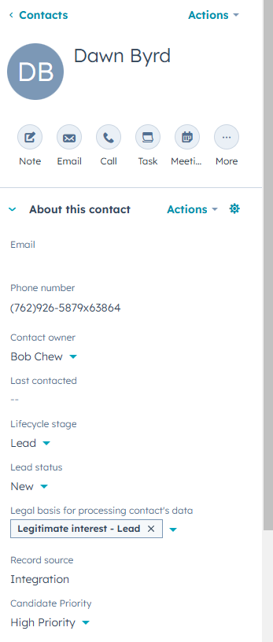

# Workstream Lead Management System

A HubSpot integration solution for managing job applicant data, demonstrating marketing automation capabilities for high-volume hourly worker recruitment.

## Features

- 🔄 **HubSpot CRM Integration**: Automated contact syncing with custom properties for recruitment

- 📊 **Custom Fields Implementation**:
  - Preferred Job
  - Availability
  - Years of Experience
  - Last Contacted
  - Text Opt-In
  - Application Status
  - Location

- 📱 **Contact Management**: Handles 1000+ contact records with recruitment-specific data

- 🔍 **Lead Tracking**: Monitors application status and candidate progression

## Technical Implementation

- **HubSpot API Integration** using Python
- **Custom Property Creation** for recruitment-specific fields
- **Batch Contact Processing** with error handling
- **Data Validation** and cleaning procedures

## Lead Management & Segmentation

### Candidate Filtering System
- **Warehouse Workforce Analysis**:
  - Total Pool: 192 warehouse candidates identified
  - Experienced Pool: 99 candidates with 2+ years experience
  - Weekend Availability: 42 candidates available for weekend shifts

### Segmentation Capabilities
- **Multi-layer Filtering**:
  - Job Type Classification
  - Experience Level Segmentation
  - Availability Matching
  - Location-based Grouping

### Recruitment Workflow
- Custom views for different hiring stages
- Quick access to candidate pools by job type
- Advanced filtering for specific requirements
- Real-time candidate status tracking

## Automation & Workflows

### Candidate Prioritization Automation
- Created automated workflow for experienced warehouse candidates.
- **Trigger Criteria**:
  - Preferred Job: Warehouse
  - Years of Experience: ≥ 2 years.
- **Automated Action**:
  - Sets Candidate Priority to "High Priority."
  - Currently affecting 30 qualified candidates.

### Results Display
- Successfully prioritized contacts are tagged as "High Priority."
- Below is a sample contact record showing:
  - Candidate Priority: High Priority (automation result).
  - Additional details such as Lead Status, Legal Basis for Processing, and Contact Owner.



### Implementation Highlights
- Successfully handled property type limitations.
- Created strategic workaround with new priority property.
- Demonstrated problem-solving in MarTech implementation.

## Results & Impact

- Successfully synced 1,000 contacts to HubSpot CRM
- 100% data integrity maintained during transfer
- Custom recruitment properties implemented and populated
- Scalable solution handling 1000+ records efficiently
- Advanced segmentation enabling targeted recruitment
- Efficient candidate filtering reducing time-to-hire
- Streamlined workflow for high-volume hiring

## Project Structure

```bash
├── data_analysis.py          # Data analysis utilities
├── list_automation.py        # List automation functions
├── hubspot_sync.py          # HubSpot integration script
├── workstream_contacts.csv   # Mock contact data
└── .env                     # Environment configuration

[def]: images/dawn_byrd_contact_record.png